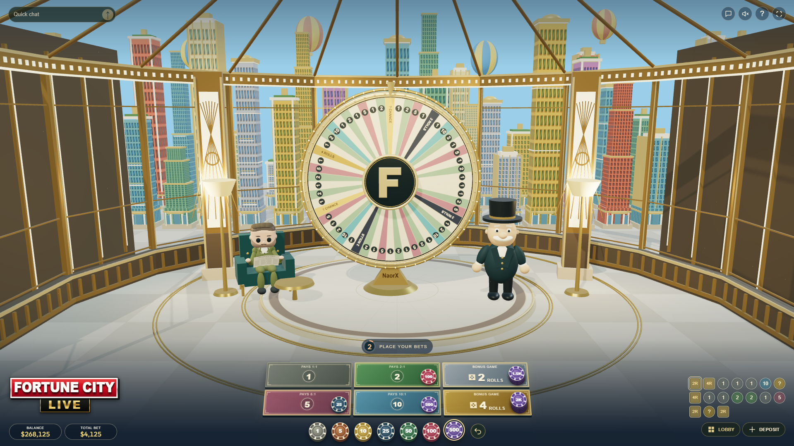
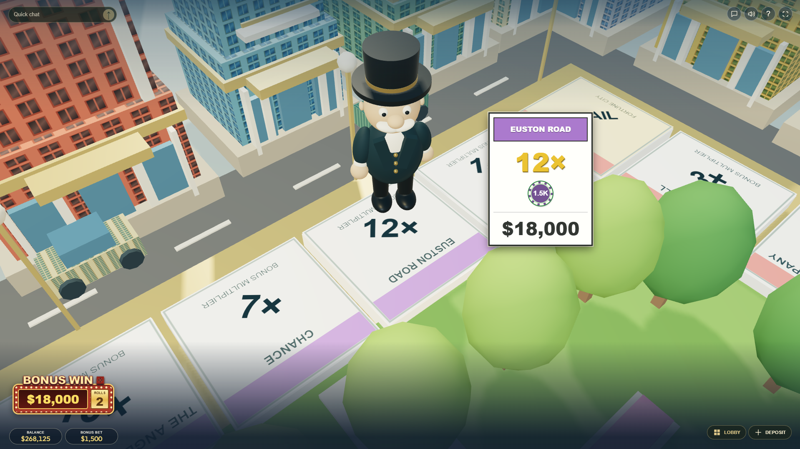
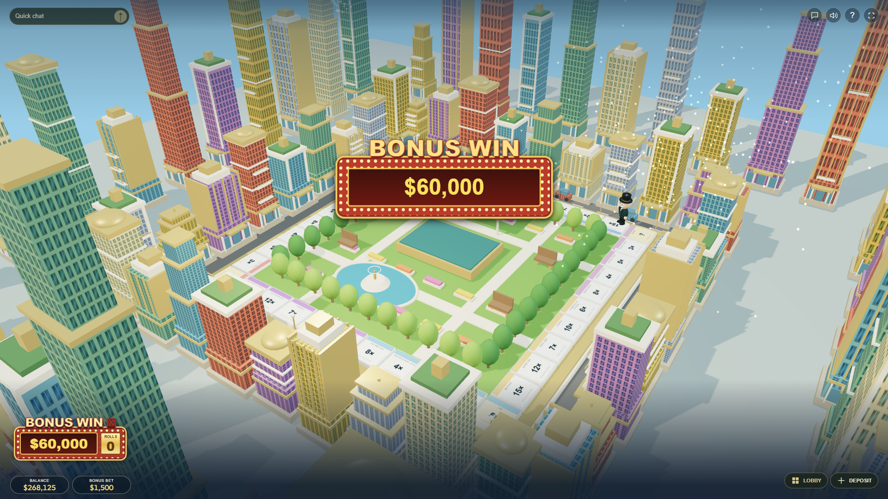

# Fortune City

**A spinning wheel. A city to explore. A little show with every round.**

Created by [NaorX](https://naorx.com), Fortune City brings an animated studio and a playable 3D city into the browser. Inspired by the presentation of **MONOPOLY Live**, it is a personal project built for the enjoyment of making and playing games.

<p align="center"><strong>Click the image below to watch the gameplay on YouTube:</strong></p>

<p align="center">
  <a href="https://youtu.be/DvYrlGD57a8">
    
  </a>
</p>

<p align="center">Prefer a quick look? Here are three snapshots from the game.</p>

<p align="center">
  <a href="docs/images/1.png"></a>
  <a href="docs/images/2.png"></a>
  <a href="docs/images/3.png"></a>
</p>
<!-- Gameplay video and screenshots go here. Upload media through GitHub or add relative links to files in the repository. -->

## Inside the game

- **The studio:** a detailed wheel, animated host, newspaper-reading guest and a daytime skyline.
- **The city:** 2 Rolls and 4 Rolls bonuses, close-up camera tours, dice, property cards and animated win totals.
- **The table:** seven chip values, Repeat Bet, undo, Chance cards and recent results.
- **The atmosphere:** background music, adjustable sound, fireworks, quick chat and layouts for desktop and mobile.

Play uses game coins with no cash value. The wallet is a demo, progress stays in your browser, and chat is local to your browser session. By default, every wheel segment is equally likely; your bets never influence the selected result.

## Try it locally

Install Node.js 18 or later, then run:

```sh
npm ci
npm run dev
```

Open **http://localhost:4173** and keep the server running while you play. The application lives in `dist/` and needs no build step. Source is grouped into scenes, characters, game rules, sound and interface modules.

## Make it your own

Edit **[dist/config.mjs](dist/config.mjs)**, save and refresh. Each setting has a short explanation. Change the starting coins, betting window, Chance frequency, bonus gifts or presentation timing without editing the game logic.

Leave `chancePercent: null` for the standard wheel distribution: Chance occupies 2 of 54 segments, approximately 3.70%. Set it to `20` for a 20% Chance frequency, or `0` to disable Chance. Custom percentages change the odds without changing the wheel artwork. No setting targets a player's bet or forces a near miss. Starting coins apply only to browsers without saved progress.

Run `npm run check` and `npm test` after changes. Invalid setting values are reported with the setting name.

## Personal use and custom work

You are welcome to run, study and modify Fortune City privately for personal, non-commercial use. Public deployment, redistribution, commercial use and removal of creator credit require prior written permission from NaorX. See [LICENSE.md](LICENSE.md) for the full terms, including the exception for repository viewing and forks allowed by GitHub.

Want a tailored version or a complete website around it? [Contact NaorX](https://naorx.com) for custom design, further development, integrations and a separate deployment or licensing agreement.

## Credits

Developed by [NaorX](https://naorx.com). Inspired by MONOPOLY Live; not affiliated with, endorsed by or licensed by Hasbro or Evolution. Third-party names and trademarks belong to their respective owners, and this project grants no rights to them. Three.js is included under its [MIT license](dist/vendor/THREE-LICENSE.txt).
